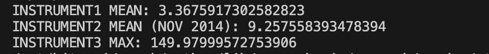
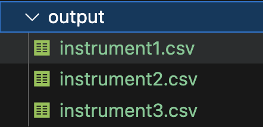
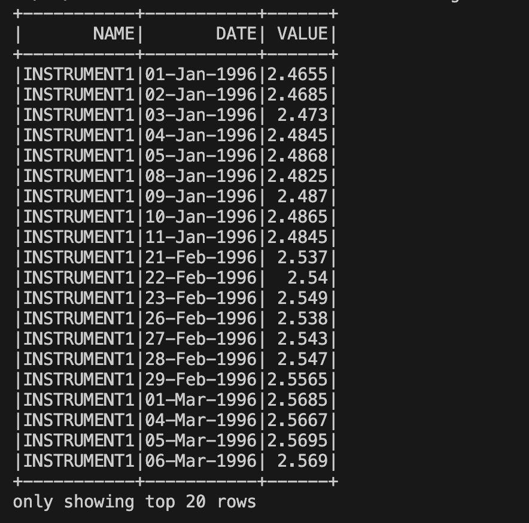

# PySpark-ELT

## Description

This is a plug-n-play project to run PySpark *py* scripts inside a Docker container. 

It uses a `docker-compose` file to create a Spark cluster with one master and two workers. 

The `Makefile` contains commands to upload files, submit and run scripts.

The `scripts/` folder contains the PySpark scripts, T

The `files/` folder contains the files to be uploaded to the container.

The `output/` directory is the destination of the resulting files copied from the container.

***This project does not require to have Spark or Java installed in the host machine, the `requirements.txt` contains the packages used, just for linting and testing.***

## Libraries / Open source dependencies

- Python ^3.11
- Docker ^24.0.7
- Make ^3.81

## Running the data stream processing

###  Run the main process script 
```bash
docker compose up --build -d && make upload FILE=example.csv && make submit-run SCRIPT=process.py
```
- StdOutput



## Pull the output file to the host machine 
```bash
make pull
```



## Makefile commands
- `make upload FILE=example.csv` - Upload an input file to the spark-master container
- `make submit SCRIPT=example.py` - Submit a script (not run yet!)
- `make submit-run SCRIPT=example.py` - Submit a *.py and inject it to the spark cluster
- `make pull` - Pull the resulting files **(This only works with after executing process.py script)**
- `make run SCRIPT=show_data.py` - Run a script **(Outputs the content of the uploaded file)**

e.g.



## Known issues
- The current Pandas library outputs a "warning message" when using the `to_datetime` method, this is not something that will break the script in the future, but it does add to the execution time (due to the stdout output). This can be solved by using a version below `2.0.0``,--- but it will make things run slower 


